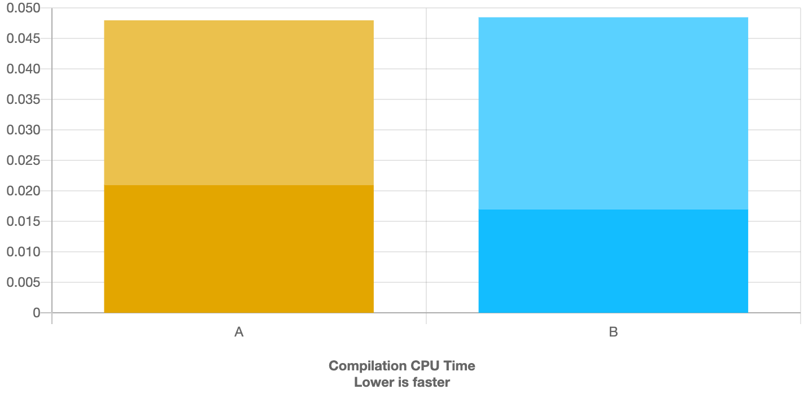
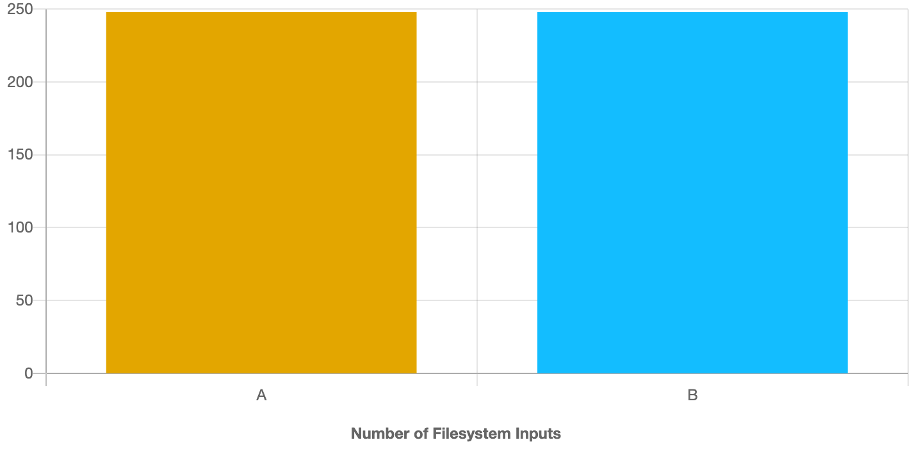

# bench-using-ns-impl

C++ Compile Speed Test

## using namespace for class implimentation

## A

```c++
namespace Test
{
class Hoge
{
public:
    void f();
};
}
```

```c++
namespace Test
{

void Hoge::f()
{
}

}
```

## B

```c++
namespace Test
{
class Hoge
{
public:
    void f();
};
}
```

```c++
using namespace Test;

void Hoge::f()
{
}

```

## Benchmark Result

### C++ Build Benchmarks

https://build-bench.com/b/2ve_dz7_3PptFpJhbqxQAFJE3nw





### GoogleTest patch test


